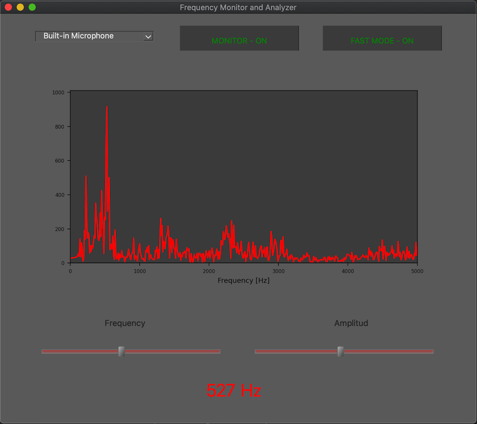

# Frequency Monitor and Spectrum Analyzer

**Description:**

**Screenshots:**

**Features and challenges:**

**Dependencies:**
- PyQt5
- matplotlib (for the FrequencyMonitor)
- numpy
- pyaudio 
- pygame (for the Spectrum Analyzer)
